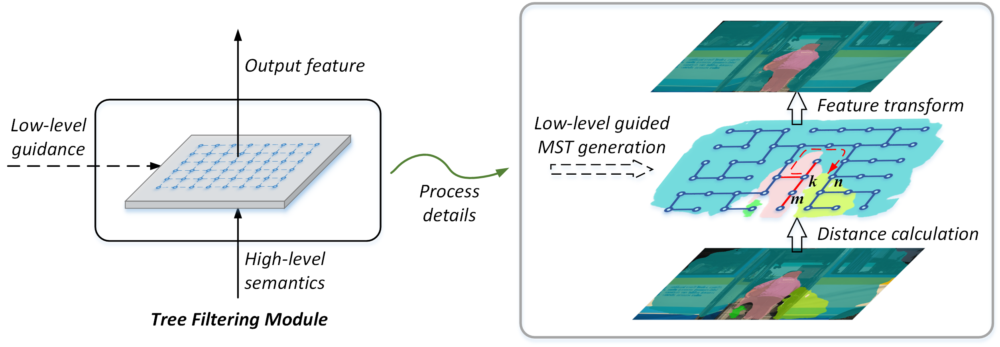

# TreeFilter-Torch
This project provides a cuda implementation for "[Learnable Tree Filter for Structure-preserving
Feature Transform](https://megvii-my.sharepoint.cn/:b:/g/personal/songlin_megvii_com/EfbrITIdvqBCu-SaW9gZOHQBFIkcIisB6-FyO9SzzrZyPQ?e=YI06YP)" on PyTorch. Multiple semantic segmentation experiments are reproduced to verify the effectiveness of tree filtering module on PASCAL VOC2012 and Cityscapes. For the reason that the experiments in the paper were conducted using internal framework, this project reimplements them on PyTorch and reports detailed comparisons below. In addition, many thanks to [TorchSeg](https://github.com/ycszen/TorchSeg).



## Prerequisites
- PyTorch 1.2
  - `sudo pip3 install torch torchvision`
- Easydict
  - `sudo pip3 install easydict`
- Apex
  - `https://nvidia.github.io/apex/index.html`
- Ninja
  - `sudo apt-get install ninja-build`
- tqdm
  - `sudo pip3 install tqdm`
- Boost (optional for Prim and  Kruskal algorithm)
  -  `sudo apt-get install libboost-dev`

## Installation
### Building from source
- `git clone https://github.com/StevenGrove/TreeFilter-Torch`
- `cd TreeFilter-Torch/furnace/kernels/lib_tree_filter`
- `sudo python3 setup.py build develop`

This project implements three well-known algorithms of minimal spanning tree, i.e., Boruvka, Kruskal and  Prim. The default algorithm is set to *Boruvka* for its linear computational complexity in the plain graph. The user can change the configuration in the source file "lib_tree_filter/src/mst/mst.cu" .

## Pretrained Model
- ResNet-50 [GoogleDrive](https://drive.google.com/open?id=1tRO4SUL0rdjXbKcyp1CQ6SefkL9QtX1b)
- ResNet-101 [GoogleDrive](https://drive.google.com/open?id=11t0f0FcLOPj7KvHYdIAGANNbbWU_fJ1d)

## Performance and Benchmarks
### Notes
FCN-32d: FCN with decoder whose maximum stride is 32;  
Extra: Global average pooling + ResBlock;  
TF: Learnable tree filtering module;  
SS: Single-scale;  
MSF: Multi-scale + Flip.

### PASCAL VOC 2012 *val* set
 Methods | Backbone | mIoU (ss) | Acc (ss) | mIoU (msf) | Acc (msf) | Model 
:--:|:--:|:--:|:--:|:--:|:--:|:--:
 FCN-32d | R50_v1c | 71.82% | 93.62% | 73.96% | 94.14% |  [GoogleDrive](https://drive.google.com/open?id=1Wzdhfa1mh_JFcqvLKPs7dXWgkOCqTnoH)
 FCN-32d+TF  | R50_v1c | 76.31%  | 94.57%  | 77.80%  | 94.96%  |  [GoogleDrive](https://drive.google.com/open?id=19wwP7KW8aCWjyd21zGLhrMz2g3lW9o9Z)
 FCN-32d  | R101_v1c | 74.53% |  94.29% | 76.08% | 94.63% |  [GoogleDrive](https://drive.google.com/open?id=19HQYK5JMS2bw2CbkTmG0VypnYfT3p-NN)
 FCN-32d+TF  | R101_v1c |  77.82% |  94.92% | 79.22%  | 95.22%  |  [GoogleDrive](https://drive.google.com/open?id=1HywWQn-sHR9iddHTiLyYHNsH3TClvQMo)
 FCN-32d+Extra | R101_v1c | 78.04%  | 95.01%  | 79.69%  | 95.41%  |  [GoogleDrive](https://drive.google.com/open?id=1dzag3GVcY9k-6ExOb1B4zQqfmtt4PbBy)
 FCN-32d+Extra+TF | R101_v1c | 79.81% |  95.38% | 80.97%  | 95.67%  |  [GoogleDrive](https://drive.google.com/open?id=1sfZyuL2pikmhWLRw9-XbrJpZJEbjawh6)
  FCN-32d+Extra+TF<sup>*</sup> | R101_v1c | 80.32% | 95.66%  | 82.28%  | 96.01%  |  [GoogleDrive](https://drive.google.com/open?id=19FpTs6NtfJLsLwN_03U4A2zTpPSIAnfS)
  
 <sup>*</sup> further finetuned on the original train set

### Cityscapes *val* set
 Methods | Backbone | mIoU (ss) | Acc (ss) | mIoU (msf) | Acc (msf) | Model 
:--:|:--:|:--:|:--:|:--:|:--:|:--:
 FCN-32d+Extra | R101_v1c | 78.29%  | 96.09%  | 79.40% | 96.27%  |  [GoogleDrive](https://drive.google.com/open?id=1MT4-ZzuCTNgfpRHGG6fT4TkUVtFuuJO5)
 FCN-32d+Extra+TF | R101_v1c | 79.58%  | 96.31%  | 80.85%  | 96.46%  |  [GoogleDrive](https://drive.google.com/open?id=1yXPEUrIZ1CfFk7-1YHgMlDNz81Fhp1kz)

## Usage
As in the original TorchSeg, distributed training is recommended for either single machine or multiple machines.  
For detailed usage, please refer to the [Training](https://github.com/ycszen/TorchSeg#Training) and [Inference](https://github.com/ycszen/TorchSeg#Inference) sections in TorchSeg.

## To do
- [ ] Experiments on ADE20K
- [ ] Visualization of tree filter
- [ ] Additional tasks
  - [ ] Object detection
  - [ ] Instance segmentation
  - [ ] Optical flow

## Citation

Please cite the learnable tree filter in your publications if it helps your research. 

```
The pre-printed version has been submitted to Arxiv and is awaiting public.
```

Please cite this project in your publications if it helps your research. 
```
@misc{treefilter-torch,
  author =       {Song, Lin},
  title =        {TreeFiler-Torch},
  howpublished = {\url{https://github.com/StevenGrove/TreeFilter-Torch}},
  year =         {2019}
}
```

